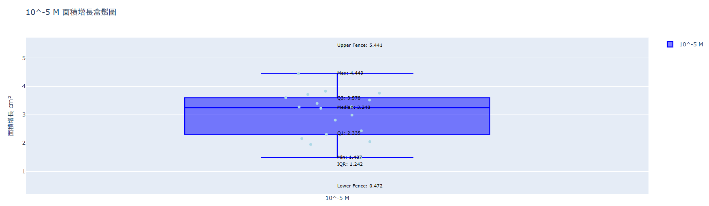
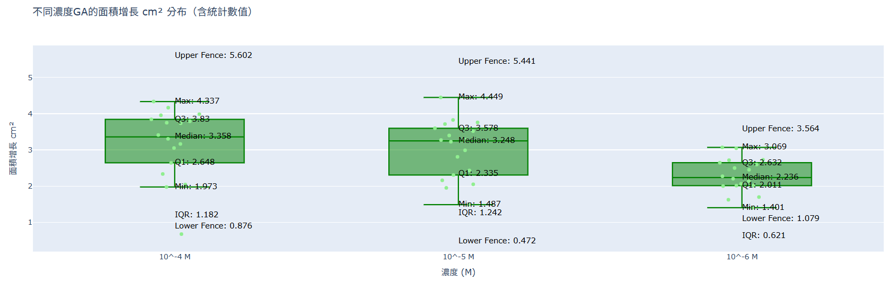
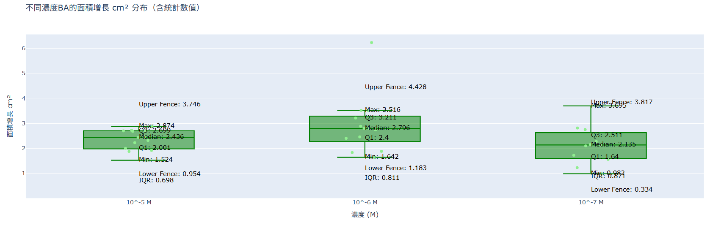
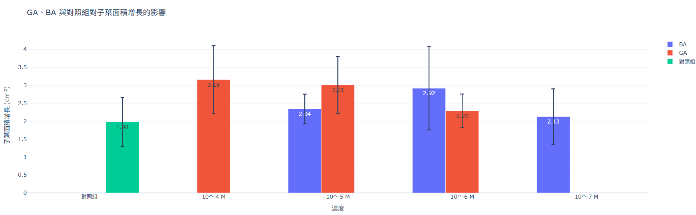
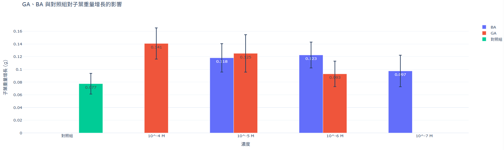
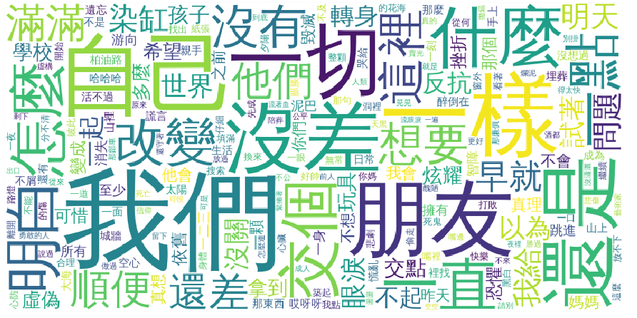
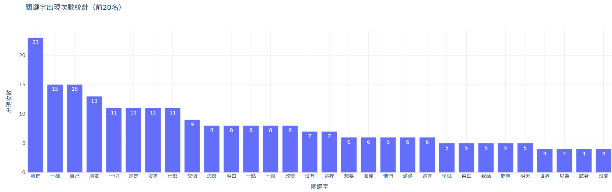

# 113-2coding
## 作業區  
**作業一連結 記帳Ai歸納分類匯入試算表:[作業一](https://github.com/kurakanja/113-2coding/blob/main/HW1.ipynb)**  
  
使用 Google Sheets 作為記帳工具 透過 LLM幫助分類消費類別（如餐飲、交通、娛樂），並匯入Google sheet與加總，使用者輸入消費與金額後，AI判斷該筆消費的類別，整理成dataframe並加總後匯入Google表單，使用者可一目了然其消費，或進行後續資料分析統計等    
**作業二連結 生物實驗數據處理:[作業二](https://github.com/kurakanja/113-2coding/blob/main/%E7%94%9F%E7%89%A9%E6%A4%8D%E7%89%A9%E7%9B%92%E9%AC%9A%E5%9C%96.ipynb)**    　
  
作業二相關報告:[點我看更詳細分析報告](https://docs.google.com/document/d/1_rFbIWTvPx5XcIhLqyhatzQqTHGtSD3INcT09gqsM0k/edit?tab=t.0)  
實驗名稱:植物激素對⼦葉⽣⻑的影響  
實驗目的:探討在不同濃度的植物激素之培養液中(吉貝素GA與細胞分裂素BA)，胡瓜⼦葉⽣⻑的差異  
實驗溶液:  
1.GA 濃度：10-4 M、10-5 M、10-6 M   
2.BA 濃度：10-5 M、10-6 M、10-7 M   
3.對照組：培養液（40mM之KCl、10mM之CaCl2）  
圖表說明  
figure.1.所有組別的10-5 M 面積增長(第五天面積減去第一天面積)分布    
figure.2.GA在不同濃度下面積增長(第五天面積減去第一天面積)分布    
figure.3.BA在不同濃度下面積增長(第五天面積減去第一天面積)分布    
figure.4.比較GA和BA在分別濃度下子葉重量增長平均    
figure.5.比較GA和BA在分別濃度下子葉面積增長平均    

**作業三連結 :[作業三](台鐵2024每站進出PCA降維與圖表分析.ipynb)**    
還在寫  
**作業四連結 歌詞詞頻與文字雲:[作業四](https://github.com/kurakanja/113-2coding/blob/main/%E6%96%87%E5%AD%97%E5%88%86%E9%A1%9E%E8%AA%B2%E5%A0%82%E7%B7%B4%E7%BF%92(%E8%8D%89%E6%9D%B1%E6%B2%92%E6%9C%89%E6%B4%BE%E5%B0%8D%E5%85%A8%E6%AD%8C%E6%9B%B2%E6%AD%8C%E8%A9%9E).ipynb)**    
  
文字雲圖  

  

詞語頻率    
