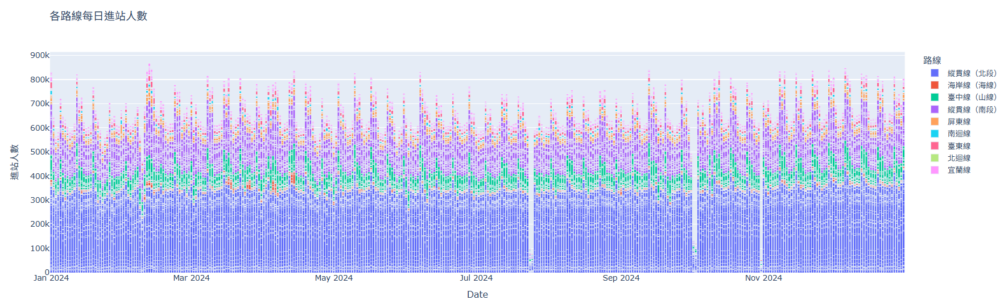
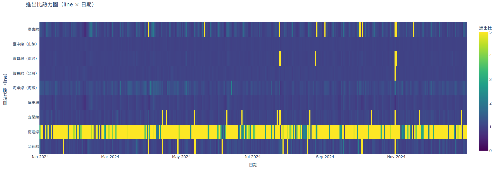
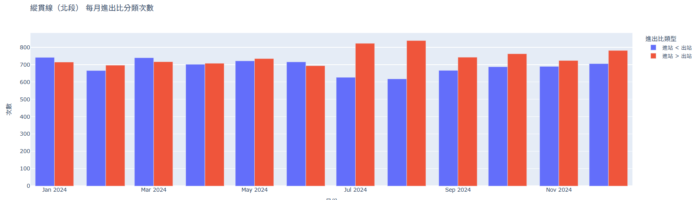
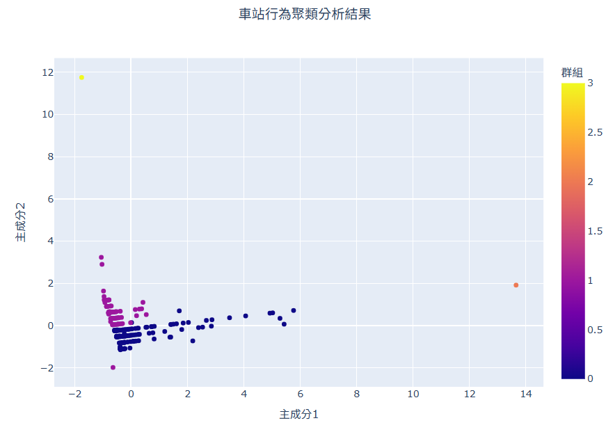
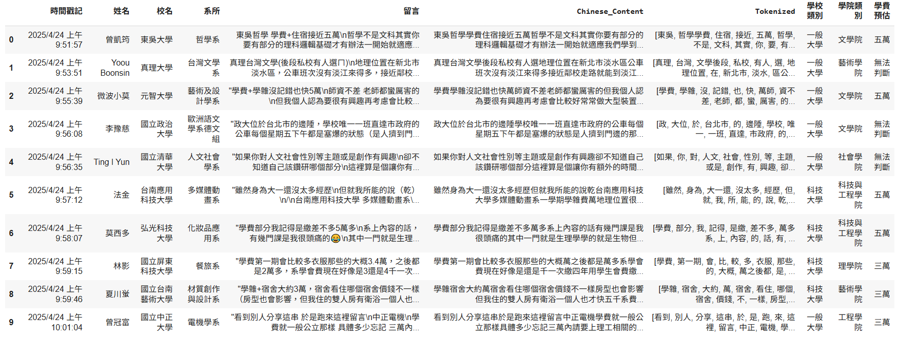
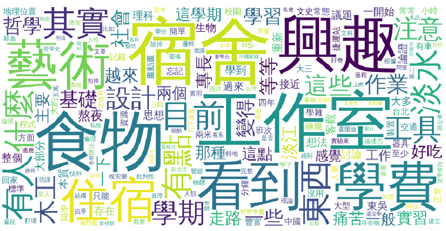
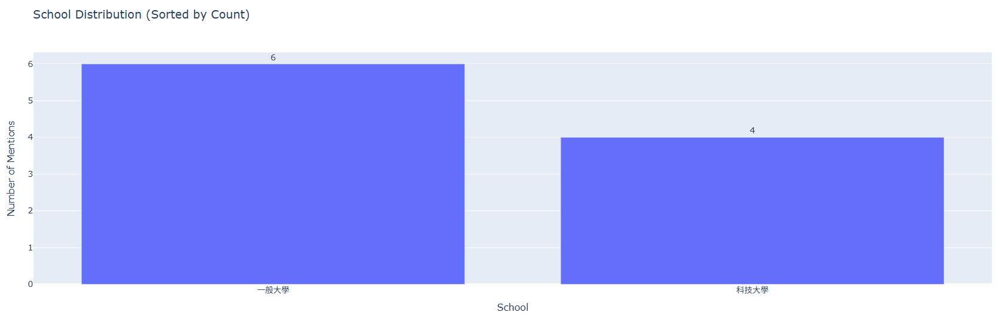
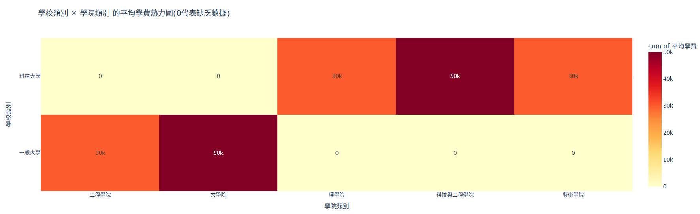

# 113-2coding
## 作業區  
## **作業一連結 記帳Ai歸納分類匯入試算表:[作業一](https://github.com/kurakanja/113-2coding/blob/main/HW1.ipynb)**  
  
使用 Google Sheets 作為記帳工具 透過 LLM幫助分類消費類別（如餐飲、交通、娛樂），並匯入Google sheet與加總，使用者輸入消費與金額後，AI判斷該筆消費的類別，整理成dataframe並加總後匯入Google表單，使用者可一目了然其消費，或進行後續資料分析統計等    
## **作業二連結 生物實驗數據處理:[作業二](https://github.com/kurakanja/113-2coding/blob/main/%E7%94%9F%E7%89%A9%E6%A4%8D%E7%89%A9%E7%9B%92%E9%AC%9A%E5%9C%96.ipynb)**    　
  
作業二相關報告:[點我看更詳細分析報告](https://docs.google.com/document/d/1_rFbIWTvPx5XcIhLqyhatzQqTHGtSD3INcT09gqsM0k/edit?tab=t.0)  
實驗名稱:植物激素對⼦葉⽣⻑的影響  
實驗目的:探討在不同濃度的植物激素之培養液中(吉貝素GA與細胞分裂素BA)，胡瓜⼦葉⽣⻑的差異  
實驗溶液:  
1.GA 濃度：10-4 M、10-5 M、10-6 M   
2.BA 濃度：10-5 M、10-6 M、10-7 M   
3.對照組：培養液（40mM之KCl、10mM之CaCl2）  
圖表說明  
figure.1.所有組別的10-5 M 面積增長(第五天面積減去第一天面積)分布    
figure.2.GA在不同濃度下面積增長(第五天面積減去第一天面積)分布    
figure.3.BA在不同濃度下面積增長(第五天面積減去第一天面積)分布    
figure.4.比較GA和BA在分別濃度下子葉重量增長平均    
figure.5.比較GA和BA在分別濃度下子葉面積增長平均    

## **作業三連結 台鐵2024每站進出PCA降維與圖表分析:[作業三](台鐵2024每站進出PCA降維與圖表分析.ipynb)**   
各路線進站人數   
一目了然那些站入站流量最高，向以此圖來看就是北段縱貫線  
各路線進出站比熱力圖    
一目了然進出比例，是大多離開還是進站，例如北迴線算平均，南迴線大多進站離開去其他地方，其他則大多入站  
北迴線月進出站比長條圖   
看出其中一線每月進出站比，是進站多還是出站多  
聚類分析  
**每個軸代表什麼？**  
x 軸（主成分1）pca1：是綜合了所有特徵的第一大變異來源，例如可能綜合了「進出站量」、「是否通勤時段為主」等，數值越高表示在這些特徵上的強度越大。  
y 軸（主成分2）pca2：第二大變異方向，通常會補足第一軸沒有說明到的部分（例如空間分佈、特定路線等特性）。  
**每一點是什麼？**  
每一點是「一個車站（staCode）」，根據它的特徵表現被降維後放在一個位置。  
滑鼠移上去可以看到：  
staCode（車站代碼）  
平均進出站量  
平均進出比  
所屬路線（line）  
所屬群組（cluster）  
**顏色代表什麼？**  
顏色是 聚類群組（cluster），由 KMeans 把特徵類似的車站分成幾群（預設是 4 群）：  
例如可能的群組意義如下：  
群組 0(藍)：大流量、進站比高、集中週一～五 → 上下班通勤站  
群組 1(紫)：小流量、進出平衡、集中週末 → 觀光型小站  
群組 2(橘)：中流量但進多出少 → 轉乘站或單向流通車站  
群組 3(黃)：特殊路線的邊緣站 → 偏遠地區小站  
  
## **作業四連結 歌詞詞頻與文字雲:[作業四](https://github.com/kurakanja/113-2coding/blob/main/%E6%96%87%E5%AD%97%E5%88%86%E9%A1%9E%E8%AA%B2%E5%A0%82%E7%B7%B4%E7%BF%92(%E8%8D%89%E6%9D%B1%E6%B2%92%E6%9C%89%E6%B4%BE%E5%B0%8D%E5%85%A8%E6%AD%8C%E6%9B%B2%E6%AD%8C%E8%A9%9E).ipynb)**    
  
文字雲圖  
將歌詞用google表單的方式逐一匯入，找出頻率最高做文字雲  
   

詞語頻率    

## **作業五連結 大學學系討論留言文字分類、實體抽取與視覺化:[作業五](大學學系討論留言文字分類.ipynb)**  
最終總表，新增了學校類別、學院類別、學費預估，學院類別與學費預估來自LLM模型
   
文字雲圖，顯示大家留言時會提到、在意的點    
  
資料中學校類別分布，分析取出的學校為一般大學還是科技大學 
  
學校類別對學院類別平均學費熱力圖，但可惜資訊有缺漏無法完整呈現  
    
AI總結內容:  
綜合以上各科系留言，可以看出學生們分享的內容涵蓋學業、生活、環境等面向，呈現多元且立體的科系樣貌。

**學業方面：**  哲學系著重批判性思考與多元觀點的培養，需具備一定的邏輯基礎；台灣文學系則以台灣文學史為主軸，較少著重傳統中國文學；藝術與設計學系強調實作能力，需投入大量時間進行大型作品創作，並需具備一定的電腦繪圖和程式設計能力；歐洲語文學系德文組則偏重基礎文法教學，口語和聽力能力則需仰賴自學；人文社會學系涵蓋範圍廣泛，適合對人文社會議題有興趣但尚未確定方向的學生；多媒體動畫系著重動畫和3D製作，需具備一定的藝術天賦和軟體操作能力；化妝品應用系則分美技組和科技組，前者著重實務操作，後者則需具備一定的化學和理科知識；餐旅系課程多元，涵蓋實務技能和理論知識，並提供技能選手培訓；材質創作與設計系則需要投入大量的時間和金錢成本於創作，並需具備一定的自我規劃能力；電機系則強調數理基礎的重要性，環環相扣的課程內容需要學生打好基礎。  

**生活與環境方面：**  不同學校的地理位置、交通便利性、住宿條件、生活費用等都有所差異。例如，部分學校位於偏遠地區或交通不便之處，學生可能需要自行解決交通問題；部分學校周邊生活機能較差，飲食選擇較少或價格較高；宿舍條件也各有不同，部分學校宿舍中籤率低，學生可能需要考慮外宿。另外，部分科系需要自行負擔額外的材料費或比賽費用等。  

**整體而言：**  學生們的分享展現了大學生活多樣的面向，提醒未來學生在選擇科系時，除了考慮自身興趣和能力外，也應充分了解各科系的課程內容、學習環境、生活成本等因素，才能做出最適合自己的選擇。 選擇科系前應仔細評估自身能力與興趣，並做好充分的心理準備，才能在大學生活中獲得滿意的學習體驗。  部分科系對學生的自主學習能力和時間管理能力要求較高，學生需要做好時間規劃，並積極主動地學習和探索。  最後，許多學生提到師資和同學對學習的影響，顯示良好的人際關係和師生互動對大學生活的重要性。  

